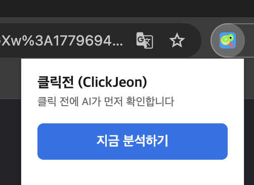
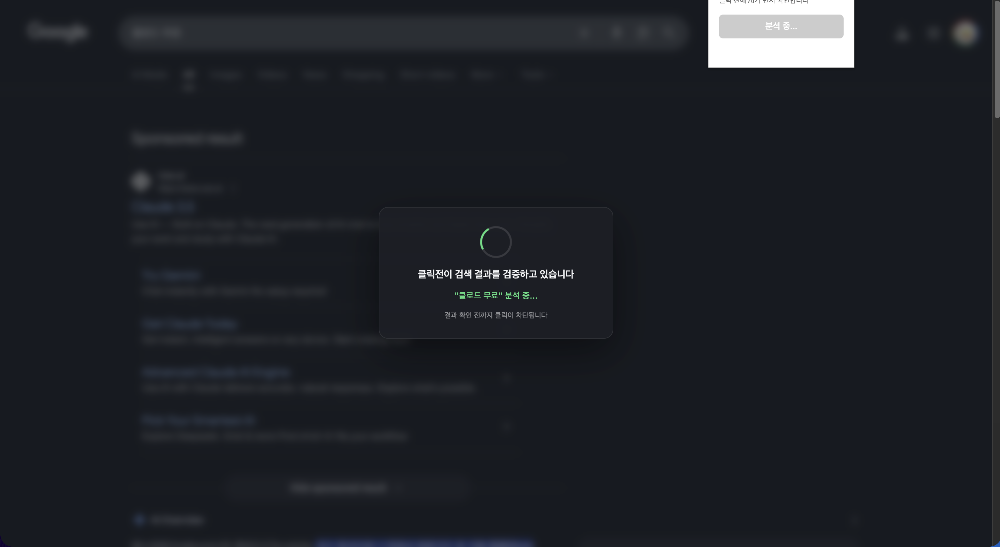
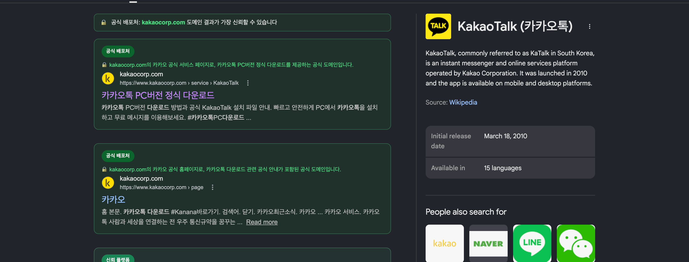
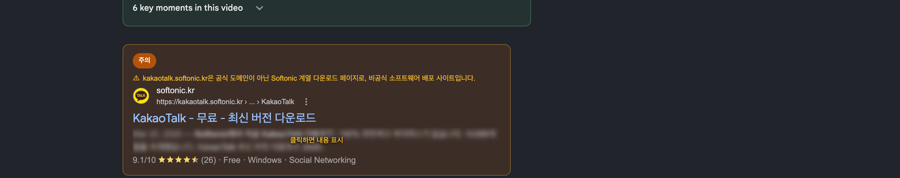
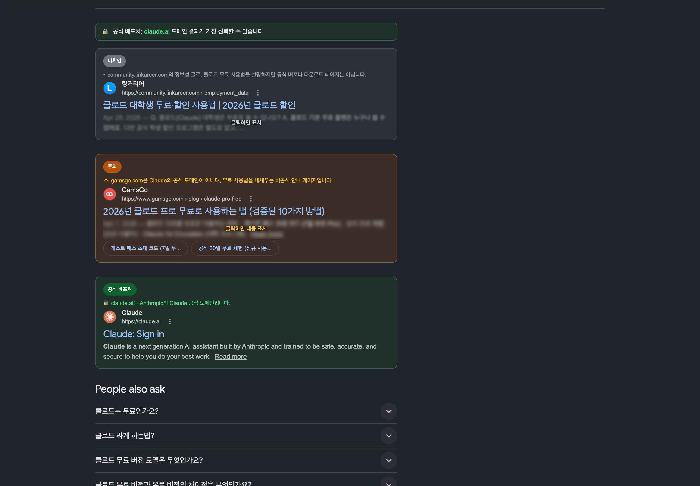

# 클릭전 (ClickJeon)

> **검색 결과를 클릭하기 전에, AI가 먼저 확인합니다**

구글 검색 결과에서 SEO 포이즈닝, 피싱 사이트, 경쟁사 우회 광고를 탐지하는 Chrome / 네이버 웨일 확장 프로그램입니다. 팝업 버튼 하나로 AI가 검색 결과 전체를 분석하고, 의심스러운 링크는 블러 처리해 클릭을 방지합니다.

> **SEO 포이즈닝이란?** 악성 사이트가 검색 엔진 최적화 기법을 악용해 공식 사이트인 척 상위 노출되는 공격입니다. "카카오톡 다운로드", "어도비 설치" 등 인기 키워드를 노려 악성코드·피싱 페이지로 유도합니다.

> **무료인가요?** 네, 완전 무료입니다. 현재 공개 서버(`clickjeon.n2f.site`)를 통해 무료로 제공됩니다. 직접 서버를 운영하고 싶다면 아래 [서버 직접 배포](#서버-직접-배포) 방법을 참고하세요.

---

## 주요 기능

- **AI 신뢰도 분석** — GPT 기반으로 각 검색 결과의 도메인과 내용을 5단계로 평가
- **광고 탐지** — 공식 도메인을 사칭하거나 SEO를 악용한 스폰서 광고 자동 식별
- **블러 처리** — WARNING·DANGER 등급 결과는 본문 + 서브링크 전체를 블러 처리
- **클릭 차단 오버레이** — 분석 완료 전까지 실수로 클릭되는 것을 방지
- **Redis 캐시** — 동일 검색어 재분석 시 즉시 응답 (TTL 30분)

---

## 등급 체계

| 배지 | 등급 | 의미 |
|------|------|------|
| 🟢 공식 배포처 | OFFICIAL | 공식 도메인 또는 공식 앱스토어 |
| 🔵 신뢰할 수 있음 | TRUSTED | 공인된 신뢰 사이트 (나무위키, GitHub 등) |
| 🟡 알 수 없음 | UNKNOWN | 신뢰도 불명확 |
| 🟠 주의 | WARNING | 경쟁사 우회 광고, 비공식 배포처 |
| 🔴 위험 | DANGER | SEO 포이즈닝, 피싱 의심 도메인 |

---

## 스크린샷

### 팝업 & 분석 시작



"지금 분석하기" 버튼을 누르면 분석이 시작됩니다.

---

### 분석 중 로딩 오버레이



분석이 진행되는 동안 화면 전체에 오버레이가 씌워져 실수 클릭을 차단합니다.

---

### 카카오톡 다운로드 검색 — OFFICIAL 결과



공식 앱스토어(App Store, Google Play)와 카카오 공식 도메인은 **공식 배포처** 배지로 표시됩니다.

---

### 카카오톡 다운로드 검색 — WARNING 결과



Softonic 같은 비공식 다운로드 사이트는 **주의** 배지와 함께 본문이 블러 처리됩니다.

---

### 클로드 무료 검색 — 복합 등급



동일 검색어에서 **위험(DANGER)**, **주의(WARNING)**, **공식 배포처(OFFICIAL)** 등급이 한 화면에 표시됩니다. 의심 결과는 본문과 서브링크까지 모두 블러 처리됩니다.

---

## 기술 스택

| 영역 | 기술 |
|------|------|
| 확장 프로그램 | Chrome / Naver Whale Extension MV3 (Vanilla JS) |
| 백엔드 | FastAPI (Python) + Vercel |
| AI 분석 | GPT-5.4-mini |
| 캐시 | Upstash Redis |
| 도메인 DB | 한국 주요 서비스 벤더 JSON + 타이포스쿼팅 탐지 |

---

## 설치 방법

**[Chrome 웹스토어에서 설치](https://chromewebstore.google.com/detail/inopiebmhgffoijdijpimkbmkicbeejh)** — Chrome / Brave / Edge 등 Chromium 기반 브라우저

**[네이버 웨일 스토어에서 설치](https://store.whale.naver.com/detail/nhpnnlhomdaheccmmcoikdmaacicmbbj)** — 네이버 웨일 브라우저

또는 소스에서 직접 로드하려면:

1. 이 저장소를 클론합니다.
   ```bash
   git clone https://github.com/lux00/ClickJeon.git
   ```
2. Chrome에서 `chrome://extensions` 를 엽니다.
3. 우측 상단 **개발자 모드** 를 활성화합니다.
4. **압축해제된 확장 프로그램을 로드합니다** 버튼 클릭 후 `clickjeon-extension` 폴더를 선택합니다.

---

## 사용 방법

1. Google에서 원하는 키워드를 검색합니다.
2. Chrome 툴바의 **클릭전** 아이콘을 클릭합니다.
3. **지금 분석하기** 버튼을 누릅니다.
4. AI 분석이 완료되면 각 결과에 등급 배지가 표시됩니다.
5. 블러 처리된 결과는 **"클릭하면 내용 표시"** 를 눌러 내용을 확인할 수 있습니다.

---

## 프로젝트 구조

```
ClickJeon/
├── clickjeon-extension/      # Chrome 확장 프로그램
│   ├── background/           # Service Worker
│   ├── content/              # Content Script + CSS
│   ├── popup/                # 팝업 UI
│   ├── utils/                # DOM 파서, 벤더 매처, 타이포 탐지
│   └── data/                 # 한국 벤더 도메인 DB
└── clickjeon-server/         # FastAPI 백엔드
    ├── routers/              # API 엔드포인트
    ├── services/             # GPT 클라이언트, Redis 캐시
    └── models/               # Pydantic 스키마
```

---

## 서버 직접 배포

자체 서버를 운영하려면:

1. `clickjeon-server/.env.example`을 복사해 `.env`를 만들고 각 키를 채웁니다.
   ```bash
   cp clickjeon-server/.env.example clickjeon-server/.env
   ```
2. Vercel에 배포합니다.
   ```bash
   cd clickjeon-server && vercel --prod
   ```
3. `clickjeon-extension/background/service-worker.js`의 API URL을 자신의 서버 주소로 변경합니다.

---

## 라이선스

MIT © 2026 lux00
